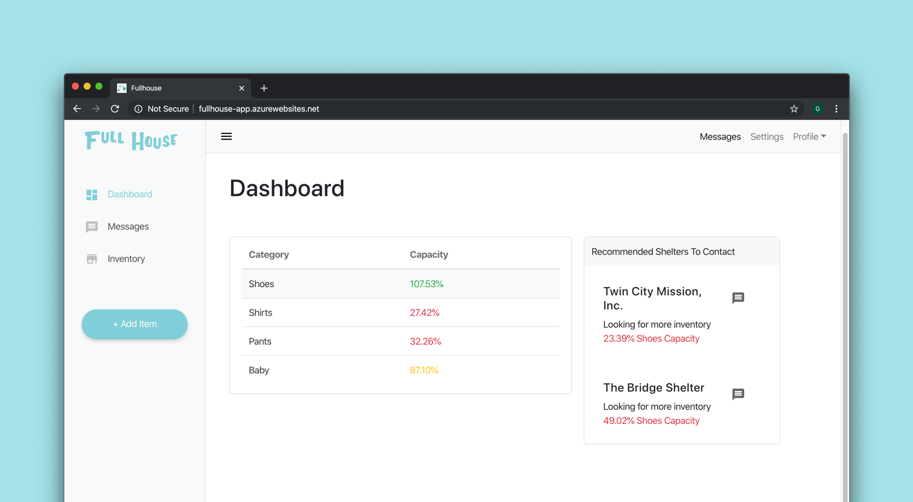

# Full House
[[Try it out]](http://fullhouse-app.azurewebsites.net/) [[Source Code]](https://github.com/anikait627/fullhouse) [[Devpost]](https://devpost.com/software/fullhouse) [[Slides]](presentation.pdf)

Communal Inventory Management for Social Service Centers designed to reduce waste and give each community their specific needs.

Winner of PwC's Hack TX 2019 challenge.

## Inspiration
One of our teammates, Aditya, was affected by Hurricane Harvey. However, he noticed that during the hurricane,   people’s generosity was on full display. But there was a problem – while some shelters and donation drives overflowed with supplies, others were still empty-handed. Donations were often abundant in certain areas of the city, while the under-served communities that need them most went without. This inspired Full House- a system for managing and balancing the inventory of multiple shelters and leveling the playing field.

## What it does
Full House has two main functions.  First, to help shelters manage their inventory by determining scarcity or surplus. And second, to connect shelters with others that may have the supplies that they need. Full House accomplishes this with a search tool that lets users easily query the inventory, and with a dashboard that recommends other shelters. 

## How we built it
The core of our product is connecting shelters together based on need. In order to get our data, we scraped Goodwill stores for product information, formatted them to be stored in our Mongo DB database, and kept track of their specific categories. With a set of categories, we could easily show what percentage of a shelter's inventory is made of a certain category, and allow shelters to specify what percentage they require. With this in hand, we could match shelters together based on their respective surpluses and shortages.

The website itself is a Node JS web server, with a React based front-end. We designed the site to emphasize simplicity and to showcase the surplus/scarcity percentages the best. The whole web app is hosted on Microsoft Azure with a Continuous Deployment workflow through GitHub Actions.  
 
## Challenges we ran into
- Connecting to MongoDB: We couldn't connect to our database through the events WiFi, so we had to connect through an independent VPN. 
- Scraping thousands of items from Goodwill websites: We needed product data in order to make reccommendations, so we scraped Goodwill's website using python.
- Populating MongoDB database with processed data: We were not familiar with MongoDB, so we had to learn how to query data, and how to process and input the scraped goodwill data into the database.
- Matching surplus with scarcity values for goods: We had to create an algorithm that matches shelters together based on their respective needs.

## Accomplishments that we're proud of
- Deploying a web app
- Scraping and processing data
- Working with and using a new database system, MongoDB

## What we learned
Working with React, MongoDB, and BeautifulSoup.

## What's next for Full House
Moving forwards, we would like to make Full House public facing, so donors could be more informed about the supplies that shelters need. This could encourage people to make smarter donation decisions, that could both help underserved communities and reduce waste. 

## Authors
- [Aditya Pethe (@aditya-pethe)](https://github.com/aditya-pethe)
- [George Thayamkery (@geooot)](https://github.com/geooot)
- [Anikait Sharma (@anikait627)](https://github.com/anikait627)
- [Anthony Teo (@eightants)](https://github.com/eightants)